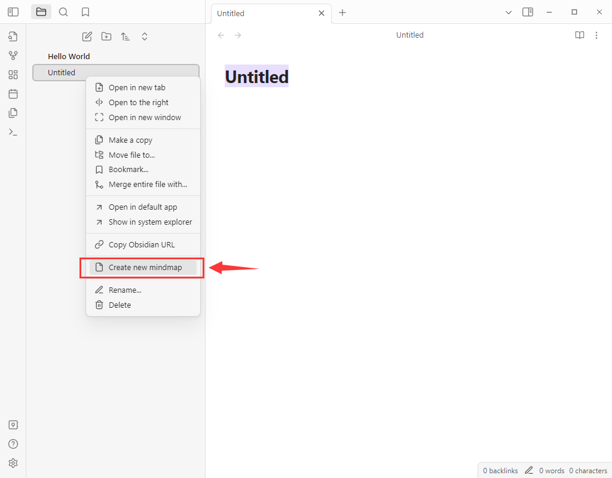
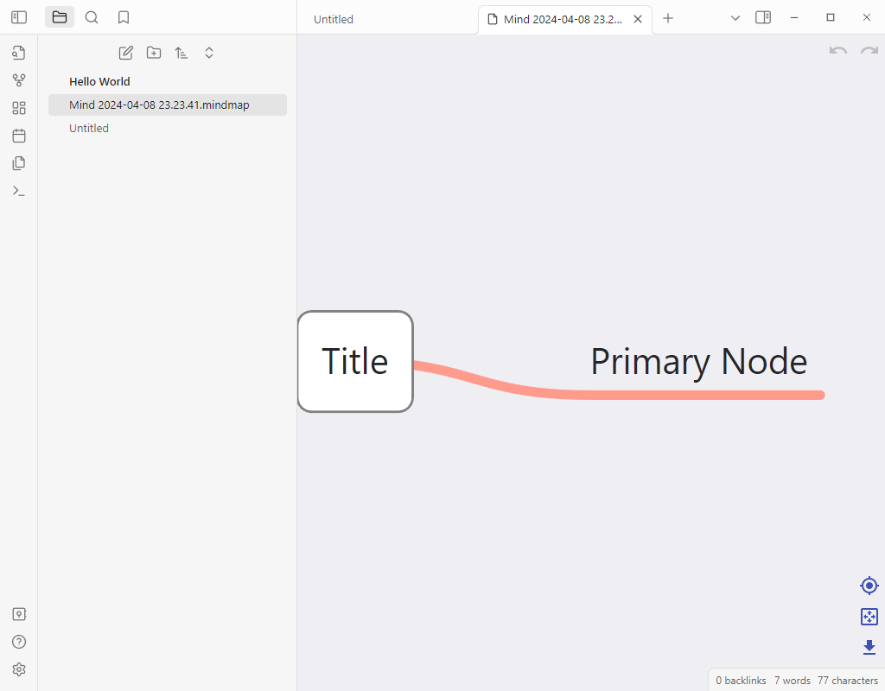

## Obsidian Mindmap

This is An Obsidian plugin for creating Mindmaps, based on [vue3-mindmap](https://github.com/hellowuxin/vue3-mindmap).

[English](README.md) | [中文](README.zh.md)

**Note:** This Obsidian plugin is still in the early stages of development and may have limitations in terms of stability and functionality!

### How to use

To create a Mindmap file, right-click in Obsidian's left file list and choose 'Creat new mindmap'.

