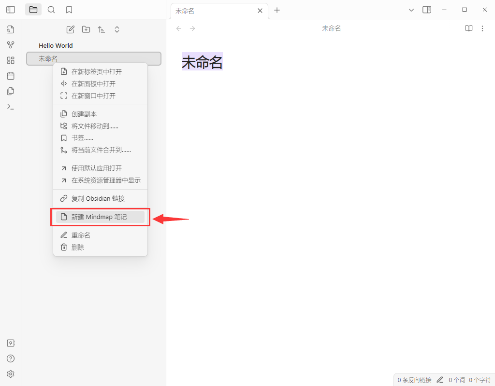

## Obsidian Mindmap

这是一个在 Obsidian 中制作思维导图的插件，基于 [vue3-mindmap](https://github.com/hellowuxin/vue3-mindmap) 。

[English](README.md) | [中文](README.zh.md)

**注意:** 这个 Obsidian 插件还处于早期开发阶段，可能存在稳定性和功能性方面的限制!

### 如何使用

通过在 obsidian 左侧文件列表右键新建 Mindmap 笔记

